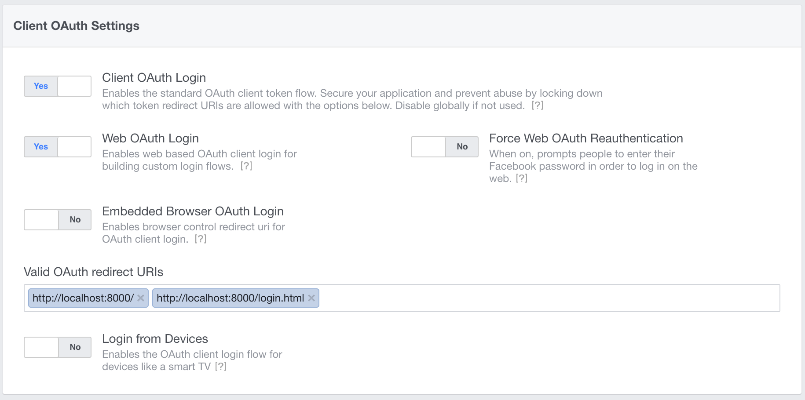

# facebook-authentication

Add Facebook Authentication to your Graphcool project 🎁

## Getting Started

```sh
npm -g install graphcool
graphcool init
graphcool module add graphcool/modules/authentication/facebook-authentication
```

## Authentication flow in app

1. The user clicks the `Authenticate with Facebook` button
2. The Facebook UI is loaded and the user accepts
3. The app receives a Facebook Access Token
4. Your app calls the Graphcool mutation `authenticateFacebookUser(facebookToken: String!)`
5. If no user exists yet that corresponds to the passed `facebookToken`, a new `FacebookUser` node will be created
6. In any case, the `authenticateFacebookUser(facebookToken: String!)` mutation returns a valid token for the user
7. Your app stores the token and uses it in its `Authorization` header for all further requests to Graphcool

## Facebook App Setup

### Create a Facebook App

To use Facebook Login you need to create a Facebook app and add the `Facebook Login` product. Follow [this guide to create an app](https://developers.facebook.com/docs/apps/register) in a few minutes.

Once you created a new APP, add the and copy its App ID. Replace `__APP_ID__` in `login.html` with your App ID.


> Note: if your API Version is something else than `v2.9`, you also need to update that in `login.html`.

Add `http://localhost:8000` and `http://localhost:8000/login.html` to your valid OAuth URIs of the `Facebook Login` product:



### Create a Facebook Token

To create a test Facebook Token, run `login.html`, for example using Python's `SimpleHTTPServer`:

```sh
python -m SimpleHTTPServer
```

Open `http://localhost:8000/login.html` in your browser and use the login button to create a new Facebook Token.

### Add the email permission

By default you have access to the `public_profile` permission that includes information about the user such as name, age range and location. If you want to access the users email you need to additionally ask for the email permission, [more information here](https://developers.facebook.com/docs/facebook-login/permissions/#adding). This is already done in `login.html`

## Test the Code

First, obtain a valid Facebook token with the small app in `login.html` as mentioned above.

Go to the Graphcool Playground:

```sh
graphcool playground
```

Run this mutation to authenticate a user:

```graphql
mutation {
  # replace __FACEBOOK_TOKEN__!
  authenticateFacebookUser(facebookToken: "__FACEBOOK_TOKEN__") {
    token
  }
}
```

You should see that a new user has been created. The returned token can be used to authenticate requests to your Graphcool API as that user. Note that running the mutation again with the same Facebook token will not add a new user.


