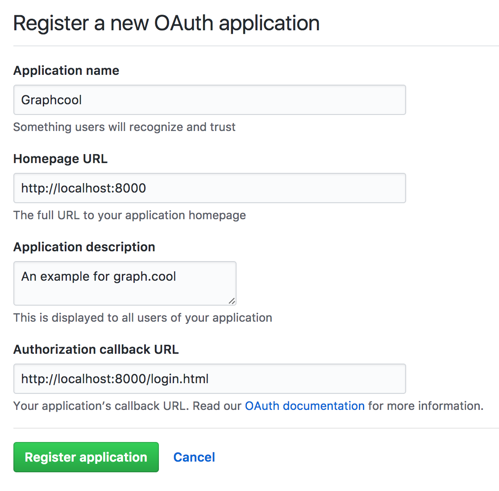

# github-authentication

Add Github Authentication to your Graphcool project 🎁

## Getting Started

```sh
npm -g install graphcool
graphcool init
graphcool module add graphcool/modules/authentication/github
```

Then, open the file `code/github-authentication.js` and replace `__CLIENT_ID__` and `__CLIENT_SECRET__` with your Github credentials.

## Authentication flow in app

1. The user clicks the `Authenticate with Github` button
2. The Github UI is loaded and the user accepts
3. The app receives a Github code
4. Your app calls the Graphcool mutation `authenticateGithubUser(githubCode: String!)`
5. If no user exists yet that corresponds to the passed `githubCode`, a new `GithubUser` node will be created
6. In any case, the `authenticateGithubUser(githubCode: String!)` mutation returns a valid token for the user
7. Your app stores the token and uses it in its `Authorization` header for all further requests to Graphcool

## Github App Setup

### Create a Github App

To use Github Login you need to create a Github app and add the `Github Login` product. Follow [this guide to create an app](https://developer.github.com/apps/building-integrations/setting-up-and-registering-oauth-apps/registering-oauth-apps/) in a few minutes.

Once you created a new APP, add the and copy its App ID. Replace `__CLIENT_ID__` in `login.html` with your Github client ID.


Add `http://localhost:8000/login.html` to **Authorization callback URL**



To create a test Github code, run `login.html`, for example using Python's `SimpleHTTPServer`:

```sh
python -m SimpleHTTPServer
```

Open `http://localhost:8000/login.html` in your browser and use the login button to authorize the app:


The Github code will be logged to the console.

## Test the Code

First, obtain a valid Github code with the small app in `login.html` as mentioned above.

Go to the Graphcool Playground:

```sh
graphcool playground
```

Run this mutation to authenticate a user:

```graphql
mutation {
  # replace __GITHUB_CODE__!
  authenticateGithubUser(githubCode: "__GITHUB_CODE__") {
    token
  }
}
```

You should see that a new user has been created. The returned token can be used to authenticate requests to your Graphcool API as that user. Note that running the mutation again with the same Github code will not add a new user.

## Contributions

Thanks so much [@katopz](https://github.com/katopz) for contributing this example :tada:


