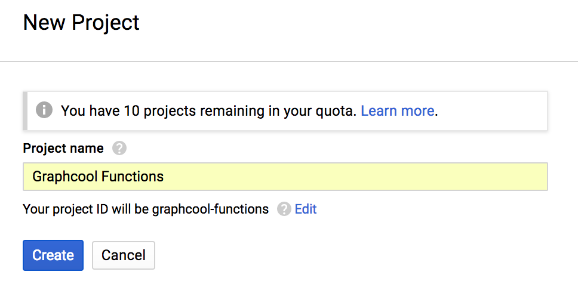
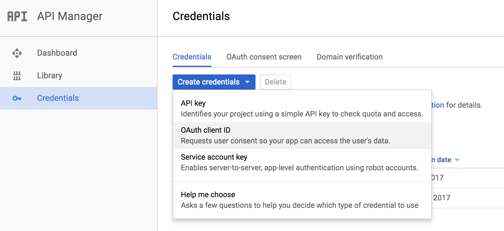
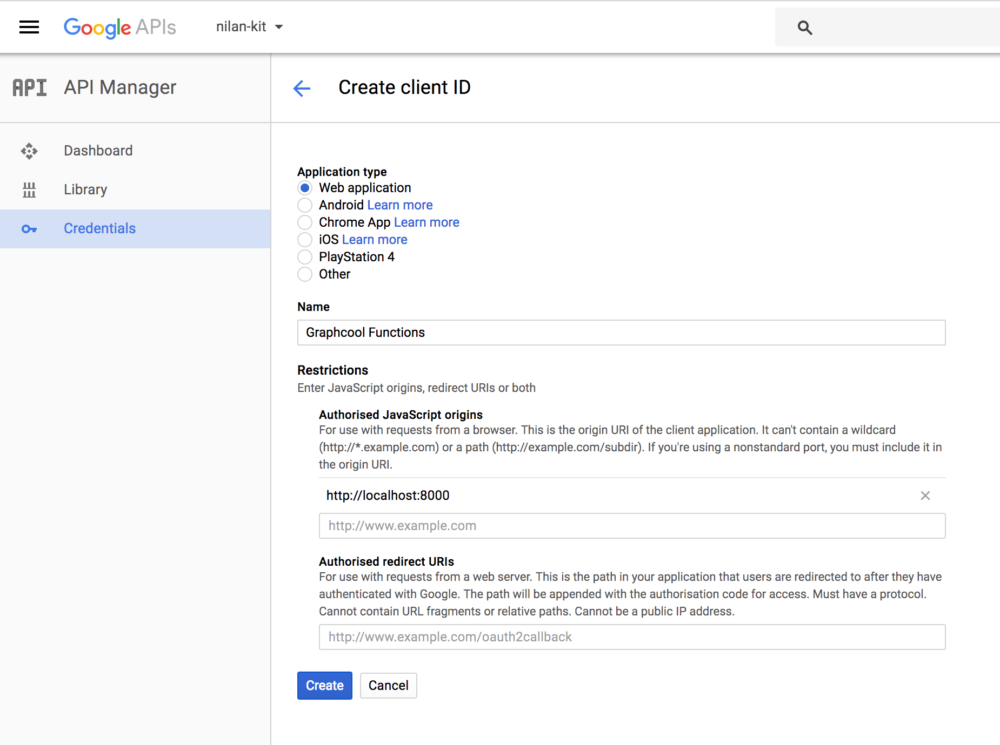

# google-authentication

Add Google Authentication to your Graphcool project 🎁

## Getting Started

```sh
npm -g install graphcool
graphcool init
graphcool modules add graphcool/modules/authentication/google
```

## Flow

1. The user clicks `Authenticate with Google` button
2. The Google UI is loaded and the user accepts to authenticate
3. Your app receives a Google Access Token
4. Your app calls the Graphcool mutation `authenticateGoogleUser(googleToken: String!)`
5. If no user exists yet that corresponds to the passed `googleToken`, a new `GoogleUser` node will be created
6. In any case, the `authenticateGoogleUser(googleToken: String!)` mutation returns a valid token for the user
7. Your app stores the token and uses it in its `Authorization` header for all further requests to Graphcool

## Setup

Follow the steps on https://developers.google.com/identity/ for how to work with the Google Identity Platform.
* First, create a new project:

  

* Click the `Credentials` tab to create new credentials. Choose `OAuth client ID`:

  

* Choose `Webapplication` as application type, and add `http://localhost:8000` as authorised JavaScript origin:

  

* Create a new Client ID

  

Copy the Client ID and use it to replace `__CLIENT_ID__` in `login.html`.

To create a test Google Token, run `login.html`, for example using Python's `SimpleHTTPServer`:

```sh
python -m SimpleHTTPServer
```

Open `http://localhost:8000/login.html` in your browser and use the login button to create a new Google Token. It will be printed in the DevTools.

## Test the Code

First, obtain a valid Google token with the small app in `login.html` as mentioned above.

Go to the Graphcool Playground:

```sh
graphcool playground
```

Run this mutation to authenticate a user:

```graphql
mutation {
  # replace __GOOGLE_TOKEN__!
  authenticateGoogleUser(googleToken: "__GOOGLE_TOKEN__") {
    token
  }
}
```

You should see that a new user has been created. The returned token can be used to authenticate requests to your Graphcool API as that user. Note that running the mutation again with the same Google token will not add a new user.


